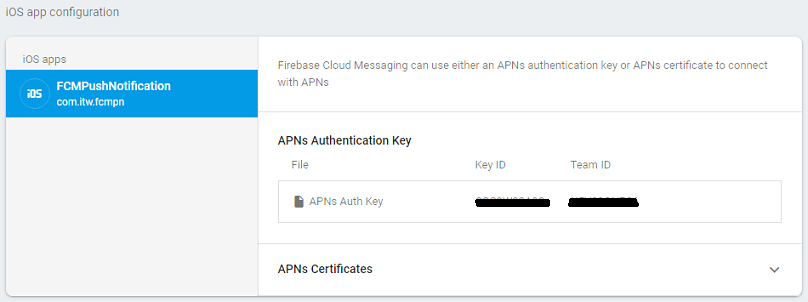

# iOS Push Notification Using Firebase
Firebase Cloud Messaging iOS client app, use the <a href="https://firebase.google.com/docs/cloud-messaging/ios/client">FirebaseMessaging</a> API.

# Requirements:
1. Install Xcode 10.1 or later.
2. Install CocoaPods 1.4.0 or later.
3. Open your project in Xcode.
4. Your project must target iOS 8 or later.
5. Swift projects must use Swift 3.0 or later.
6. Set up a physical iOS device or the iOS simulator for running your app.

<b>For Cloud Messaging, you'll need:</b>
1. A physical iOS device
2. An Apple Push Notification Authentication Key for your Apple Developer account
3. In Xcode, enable Push Notifications in App > Capabilities.
4. For all other Firebase products, you can use either a physical iOS device or the iOS simulator.

# Firebase Register Project Steps:
<b>Step: 1.1</b> 

<b>Step: 1.2</b> 

<b>Step: 1.3:</b> 

<b>Step: 1.4:</b> 

<b>Step: 1.5:</b> 
Next, Firebase overview > setting > cloud messaging
Add APNS Authentication key related your project. 

# Setup CocoaPods with required configuration:
<b>Step: 2.1:</b> 

<b>Step: 2.2:</b> 

# Output:
